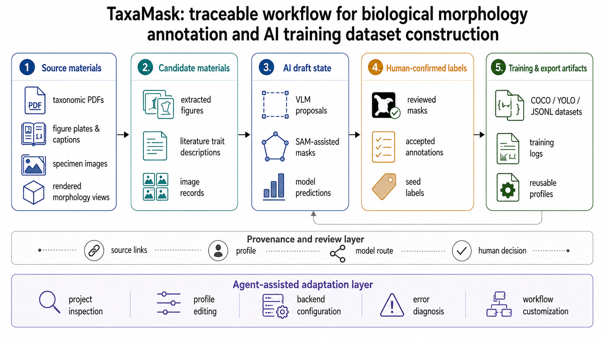
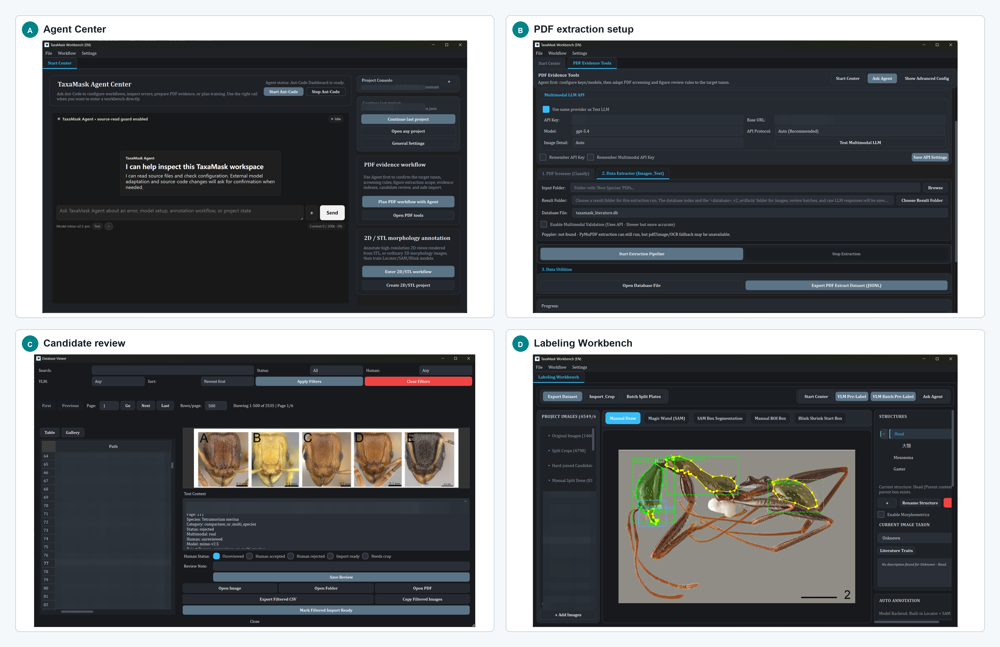
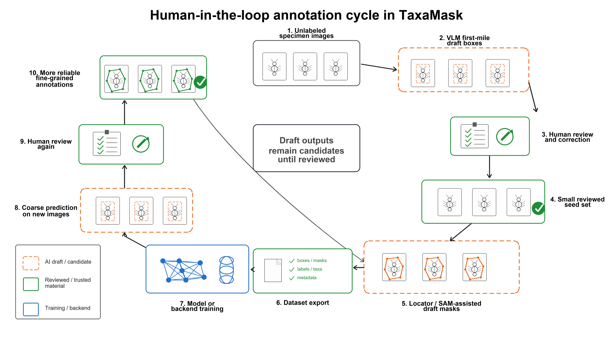
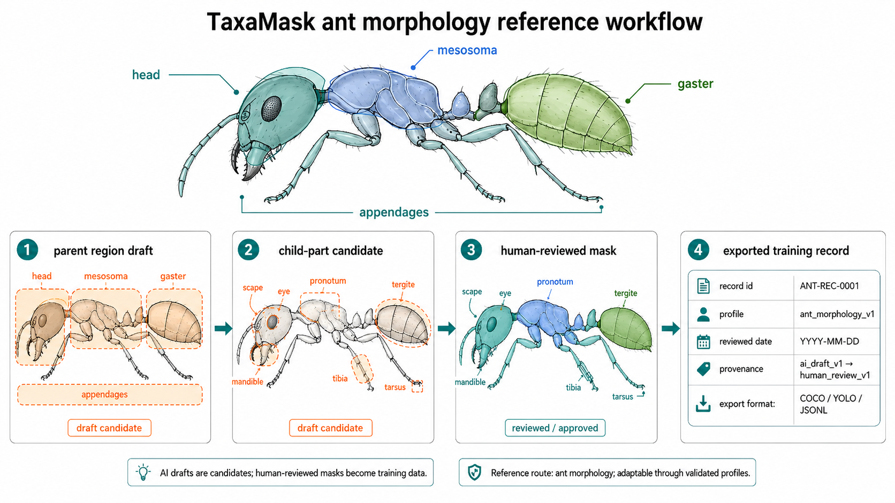

# TaxaMask - Morphological Body-Part Mask Annotation, Evidence Review, and 3D Morphology Workbench

[](https://doi.org/10.5281/zenodo.20619867)

[中文 README](README_zh.md)

**TaxaMask** is an open-source desktop workbench for AI-assisted mask annotation of organismal body parts, taxonomic evidence review, and human-reviewed training dataset construction.

Originating from real-world ant taxonomy research and designed for morphology-based taxonomic groups beyond ants, TaxaMask connects taxonomic literature, specimen images, STL-rendered morphology views, AI-assisted mask drafts, human review, model training, and dataset export in one traceable pipeline. It supports Segment Anything (SAM) draft masks, Vision-Language Model (VLM) first-mile proposals, parent/child body-part annotation, and provenance-aware export to multimodal JSONL, COCO, and YOLO-style datasets.

The current `main` branch is the active v2.x line. It keeps the 2D/STL morphology and PDF evidence workflows as the core public use case, while also integrating the embedded Agent Center and the newer TIF/CT 3D workbench in one maintained branch. The TIF/CT route has been developed and tested mainly with AntScan ant CT data. Its data structures are not hard-coded to ants, but broad multi-taxon validation is not yet claimed.

## Visual Overview



TaxaMask keeps source materials, candidate images, AI drafts, human-confirmed labels, exported datasets, and model feedback connected through project records. Researchers can move from literature screening and image extraction to annotation, review, training, prediction checking, and dataset export while preserving provenance.



The public interface centers on practical workflow entries: Agent Center for local workflow help, PDF Evidence for literature material, candidate review for screening imported images, 2D/STL Morphology for reviewable mask annotation, and TIF Volume for internal 3D morphology work.

## Release 2.0.1

TaxaMask `v2.0.1` is a focused maintenance release for the TIF/CT workbench. It keeps the `v2.0.0` main-line scope while tightening the batch TIF import, ROI location, part-volume creation, and part-mask draft cleanup workflow:

- Batch TIF import remains metadata-first, and selecting a metadata-only specimen now starts working-volume generation with clearer slice-review and 3D-preview status messages.
- Newly imported TIF specimens no longer receive a default center ROI box; part location is driven by researcher-drawn ROI rectangles on the actual slice content.
- The visible part workflow is now Draw ROI -> optional Save ROI draft -> Confirm ROI, reducing overlap with the older Create part control.
- ROI location supports key-slice rectangle shells in one view direction, so the initialized part mask can follow a changing head or body-part outline instead of only a rigid rectangular block.
- ROI shell rectangles initialize the part mask but are not written into the later part-mask `contours.json`, keeping part-mask editing separate from part-location history.
- Existing projects with legacy ROI-shell rectangles in part contours can ignore those stale key slices during auto-fill preview and clear them with the new Clear key slices action.
- Regression coverage was added for metadata-only TIF loading, ROI key-slice drafts, ROI-to-part mask initialization, legacy ROI-shell filtering, and part-mask cleanup.

TaxaMask `v2.0.0` is the main-line release that brought the established 2D/STL morphology workflow, PDF evidence tools, Agent Center, and the newer TIF/CT workbench into one maintained branch:

- The 2D/STL morphology workflow remains the main route for specimen images, taxonomic plates, rendered STL views, SAM/VLM drafts, parent/child body-part annotation, model-review loops, and COCO / YOLO / JSONL export.
- PDF evidence tools remain available for literature screening, figure/caption extraction, candidate review, and provenance-backed trait-description records.
- TIF/CT is promoted into `main` as an additional internal-morphology workbench for TIFF stacks, part volumes, 3D preview, and local-axis reslicing.
- Dark Mode now uses the deeper **Deep Space Neon** palette with restrained navy and silver-blue light effects.
- Light Mode is available as a real bright workspace theme, including refreshed Qt palettes and semantic button styles.
- The embedded Agent Center dashboard follows the active theme, including the transcript, composer, prompt input, send button, and status chips.

The preprint-submission state is preserved on the `preprint-submission` branch and in the `v1.4.0` release. New development happens on `main`.

## Core Workflows

TaxaMask now has four connected research routes:

```text
PDF evidence
  -> figure/caption extraction
  -> candidate review
  -> traceable literature evidence

2D / STL morphology
  -> parent and child part annotation
  -> AI drafts and human review
  -> training dataset export

TIF / CT internal morphology
  -> specimen import
  -> part ROI and key-slice masks
  -> part volume extraction
  -> 3D preview and local-axis reslice export

Agent Center
  -> workflow inspection
  -> error explanation
  -> profile and backend help
  -> code changes after researcher confirmation
```

The program is designed around human-reviewed morphology data. AI outputs, imported predictions, and automated suggestions remain draft material until a researcher accepts them.

## 2D / STL Morphology Workbench

The 2D/STL workflow is TaxaMask's most mature annotation route. It is intended for researchers who need to turn specimen photographs, taxonomic plates, microscope images, or rendered STL/mesh views into auditable body-part masks and training datasets.

TaxaMask organizes morphology material by review state: source material, candidate material, AI draft, human-confirmed label, model prediction, and exported dataset are kept distinct in the project record. PDF figures, captions, literature trait descriptions, specimen images, STL-rendered views, VLM boxes, SAM masks, external backend predictions, and human masks can enter the same review chain without being merged automatically into training truth.

Current 2D/STL capabilities include:

- Importing ordinary morphology images and STL-derived rendered views into the Labeling Workbench.
- Treating STL views as reviewable 2D morphology images while preserving specimen/view provenance.
- Parent-part and child-part body-structure annotation for hierarchical morphology work.
- Editable body-part vocabularies through profiles, so a lab can adapt labels for insects, ants, arthropods, plants, or other morphology-based groups.
- VLM first-mile draft boxes and optional SAM-assisted draft masks.
- Human review loops for AI drafts, locator predictions, child-part experts, and external model outputs.
- Route-specific child-part refinement through Blink, heatmap Blink, or external Blink-style backends.
- SQLite-backed 2D project storage for large annotation and review projects, with legacy JSON migration support.
- Dataset export to multimodal JSONL, COCO, and YOLO-style formats for computer-vision, VLM, or custom fine-tuning workflows.

TaxaMask is centered on masks, body-part labels, and traceable training data. Keypoint or landmark workflows should be treated as profile-specific extensions rather than the default export contract.

## PDF Evidence and Provenance

TaxaMask includes a literature evidence route so morphology datasets can stay connected to the publications and figure sources that motivated them.

Current PDF and evidence capabilities include:

- PDF literature screening with editable taxonomy profiles.
- Figure and caption extraction with accepted and needs-review output folders.
- Literature trait-description extraction into provenance-backed `taxon -> part -> description` records.
- Candidate review before images enter a morphology project.
- Headless tools for PDF screening, candidate generation, VLM review, and export workflows.

PDF outputs are evidence and candidate material. They should not become 2D/STL training truth or TIF `manual_truth` without researcher review.

## Body-Part Vocabulary and Adaptation

TaxaMask uses editable profiles so a project can bridge general organism terms, insect and arthropod body-part names, and taxon-specific labels. In insect or ant workflows, searchable body-part terms may include head, thorax or mesosoma, abdomen or gaster, antennae, mandibles, legs, wings, appendages, and other fine-grained specimen structures.

Other taxa can use the same workflow pattern by adapting profiles, reviewing small batches first, and validating model behavior before scaling up.



TaxaMask treats VLM boxes, SAM masks, locator predictions, TIF proposals, and external backend outputs as draft material until a researcher reviews them. This keeps AI assistance useful while keeping generated candidates separate from ground-truth labels.



TaxaMask is currently most extensively validated on ant morphology workflows. In the reference case, it was used to organize literature screening, image extraction, VLM first-mile pre-annotation, human review, parent-part annotation, training, prediction review, and dataset export.

## Who Should Use TaxaMask?

TaxaMask is intended for researchers and research groups who need to:

- Annotate organismal body parts with masks for morphology, taxonomy, biodiversity, or phenomics projects.
- Build human-reviewed segmentation datasets from specimen images, taxonomic plates, microscope images, or rendered STL morphology views.
- Link taxonomic trait descriptions, figure captions, specimen images, AI drafts, model predictions, and final labels in one auditable project.
- Use SAM, VLM, Locator, Blink, or external backend outputs as reviewable drafts rather than unverified ground truth.
- Export multimodal JSONL, COCO, or YOLO-style datasets for computer-vision, VLM, or custom fine-tuning workflows.
- Adapt the same workflow to a new taxon, body-part vocabulary, local model backend, or lab-specific annotation route.
- Extend the workflow to internal morphology when TIFF stacks or CT-derived volumes need 3D inspection, part-volume extraction, or local-axis reslicing.

## TIF / CT 3D Workbench

The TIF/CT workflow extends TaxaMask from external morphology images into internal volumetric morphology. It is intended for TIFF stacks or CT-derived volumes where the original scan direction, specimen posture, and target structure orientation vary between samples.

Current TIF/CT capabilities include:

- Importing a TIFF stack as a specimen.
- Viewing the full volume and extracted part volumes.
- Drawing part ROIs and key-slice contours.
- Interpolating masks between key slices.
- Accepting part masks and writing part-volume records.
- GPU 3D volume preview with streamed texture building, cache reuse, clipping, transfer-function presets, themed clear colors, and section inspection.
- ROI high-detail 3D inspection for checking local structures without editing source data.
- Metadata-only TIF registration followed by explicit working-volume materialization for large stacks.
- Z/Y/X slice navigation for multi-direction review.
- Local Axis Reslice for a selected part volume.
- Source Z-axis display as a locked reference.
- Editable output Z-axis for the reslice direction.
- Roll reference point pair for orientation standardization.
- Resliced grayscale TIFF export, with metadata JSON.
- Optional mask TIFF export when a part mask is available.
- Training-material records that capture manual part extraction and local-axis decisions for later model development.

The local-axis workflow is intentionally generic. The first validated template is brain/head oriented, but the module is named **Local Axis Reslice** and stores general local-frame metadata rather than brain-only fields.

Implementation note: the TIF/CT 3D preview is an independent TaxaMask implementation built for the PySide6 / PyOpenGL TIF workbench. It uses common GPU volume-rendering ideas such as 3D textures, transfer mapping, ray marching, clipping, and section inspection. The interaction target is informed by established scientific volume-visualization tools, including Drishti.

## Local Axis Reslice Concept

A reslice is saved under a specimen part, not as a modification of the original TIFF.

```text
specimen
  -> parts
     -> head
        -> mask
        -> contours
        -> reslices
           -> reslice item
              -> image.tif
              -> metadata.json
              -> mask.tif, when available
```

The original TIFF stack remains unchanged. A reslice records:

- source volume and part volume identity
- source Z-axis reference
- editable output Z-axis
- local frame: origin, x axis, y axis, z axis
- roll reference point pair
- spacing and interpolation settings
- export paths and provenance metadata

Grayscale image reslicing uses linear interpolation. Mask and label reslicing use nearest-neighbor interpolation.

## Agent Center

TaxaMask includes the first-party Ant-Code Agent Center under `vendor/ant-code/`. It helps inspect project state, explain errors, review profiles, and make code changes after confirmation.

Agent model credentials and private gateway settings are local runtime configuration. They are not included in this repository. The embedded runtime is pointed at:

```text
AntSleap/config/taxamask_ant_code.config.json
```

The GUI can start without API keys. Model-backed chat, VLM drafts, and external routes require local configuration on the user's machine.

## Data Boundary

TaxaMask is source code and public workflow documentation. Private CT stacks, local project files, exported results, model weights, runtime settings, API keys, and internal planning notes should stay on the user's machine and are ignored by default.

## Installation

TaxaMask is distributed as source-based research software.

Validated target environments:

- Windows 10/11 for the main desktop workflow.
- Linux workstations for CUDA training and batch processing.
- macOS can be tried for lightweight CPU review, but Apple Silicon acceleration is not a validated target.

Prerequisites:

- Git, or a GitHub ZIP download.
- Conda or another Python environment manager.
- Python 3.12.
- Node.js 20 or newer for the embedded Agent Center dashboard.

Clone the maintained main branch:

```bash
git clone https://github.com/wicm84266964/TaxaMask.git
cd TaxaMask
```

For the frozen preprint-submission state, use the `preprint-submission` branch or the `v1.4.0` release:

```bash
git clone --branch preprint-submission --single-branch https://github.com/wicm84266964/TaxaMask.git
cd TaxaMask
```

Create and activate a Python environment:

```bash
conda create -n taxamask python=3.12
conda activate taxamask
```

Install PyTorch first. For CPU-only testing:

```bash
pip install -r requirements-torch-cpu.txt
```

For NVIDIA CUDA 12.1:

```bash
pip install -r requirements-torch-cu121.txt
```

Then install the base dependencies:

```bash
pip install -r requirements.txt
```

Install the Agent Center dependencies:

```bash
cd vendor/ant-code
npm ci
cd ../..
```

Optional SAM-assisted 2D annotation requires a SAM checkpoint placed at:

```text
AntSleap/weights/sam_b.pt
```

Model weights are not included.

## Run

From an activated environment:

```bash
python AntSleap/main.py
```

Windows users can also run:

```bat
启动TaxaMask.bat
```

Linux or WSL users can run:

```bash
bash ./启动TaxaMask.sh
```

If source-code changes prevent the GUI from starting, launch the Agent Center recovery dashboard directly:

```bash
node vendor/ant-code/src/cli/dashboard.js --project . --port 7410
```

On Windows, `启动AntCode修复面板.bat` uses this recovery route.

### TIF / CT GPU Notes

The TIF/CT volume preview works best when the Python interpreter is assigned to the dedicated NVIDIA GPU. On Windows laptops or desktops with both integrated graphics and an NVIDIA card, set the selected `python.exe` to **High performance** in Windows Graphics settings or NVIDIA Control Panel. The `启动TaxaMask.bat` launcher now searches the `taxamask` Conda environment before the older `antsleap` environment, so update any `TAXAMASK_PYTHON_EXE` override if your environment name changed. After opening a TIF project, check the volume preview status line: it reports the active OpenGL renderer and makes integrated-GPU or CPU fallback problems visible.

## Repository Layout

```text
AntSleap/                  Python package and Qt workbenches
AntSleap/core/             Project, TIF, extraction, export, and backend logic
AntSleap/ui/               Desktop UI, 2D labeling, PDF, TIF, and Agent panels
core/pdf_processor/         PDF screening and extraction logic
tools/agentic/              Headless PDF, candidate, VLM, and export tools
tif_blink/                  TIF-local model route experiments and helpers
tif_blink_nnunet/           nnU-Net oriented TIF helper route
screener_configs/           PDF screening templates and examples
multimodal_configs/         Figure extraction and review profiles
part_description_configs/   Literature trait-description extraction profiles
json_projects/templates/    Clean project templates
docs/contracts/             Public backend and TIF local-axis contracts
vendor/ant-code/            First-party Agent Center runtime
tests/                      Unit and workflow tests
TaxaMask使用手册.md           Chinese user manual
```

The internal package name `AntSleap` is kept for runtime stability and as a tribute to the SLEAP project that inspired the original direction. The public project name is TaxaMask.

## Typical Workflows

PDF evidence route:

1. Configure or adapt a PDF screening profile.
2. Extract figures, captions, and literature trait descriptions.
3. Review accepted and needs-review outputs.
4. Import useful candidates into TaxaMask projects.

2D / STL morphology route:

1. Import specimen images or rendered STL views.
2. Annotate parent and child morphology structures.
3. Treat VLM, SAM, and model predictions as drafts.
4. Confirm labels manually.
5. Export training datasets.

TIF / CT route:

1. Open an AntScan or other TIFF stack.
2. Create a specimen part with ROI and key-slice masks.
3. Extract a part volume.
4. Review the part in 3D and multi-direction slices.
5. Copy the source Z-axis into an editable local output axis.
6. Set roll reference points for orientation standardization.
7. Export the resliced part TIFF and metadata.

## External Backend Contracts

- [Parent-part external backend contract](docs/contracts/external_backend_contract_v1.md)
- [Child-part Blink external backend contract](docs/contracts/external_blink_backend_contract_v1.md)
- [TIF local-axis backend contract](docs/contracts/tif_local_axis_backend_contract_v1.md)

External backend predictions are review candidates. They should not be treated as confirmed training truth until checked by a researcher.

## Documentation

- [Chinese README](README_zh.md)
- [Chinese user manual](TaxaMask使用手册.md)
- [Platform setup](docs/platform_setup.md)
- [PDF screening profile guide](docs/PDF筛选profile适配说明.md)
- [Figure extraction and multimodal profile guide](docs/图文提取与多模态profile适配说明.md)
- [External backend contracts](docs/contracts/)

## Keywords

taxonomy morphology annotation, biological image annotation, taxonomic literature evidence, PDF figure extraction, caption extraction, AI-assisted annotation, human-in-the-loop review, training dataset construction, COCO export, YOLO export, VLM pre-annotation, SAM-assisted annotation, STL morphology review, CT morphology, TIFF stack, TIF workbench, AntScan, 3D volume preview, GPU volume rendering, part volume extraction, key-slice mask interpolation, local-axis reslicing, morphology segmentation, internal morphology, ant taxonomy, Formicidae, biodiversity informatics, Agent Center

## Citation

If TaxaMask helps your research, please cite the software release:

```text
TaxaMask: a taxonomy-oriented morphology annotation, evidence review, and dataset workbench.
Zenodo DOI (all versions): https://doi.org/10.5281/zenodo.20619867
```

## License

TaxaMask source code is licensed under the GNU Affero General Public License v3.0. Commercial use is allowed under the license, but modified versions and network services must comply with AGPLv3 source-disclosure obligations. See [LICENSE](LICENSE) and [NOTICE](NOTICE).

The bundled Ant-Code Agent Center under `vendor/ant-code/` is first-party TaxaMask source code. The directory name is retained for runtime layout compatibility; it should not be interpreted as a third-party dependency or excluded from attribution for the TaxaMask project.
