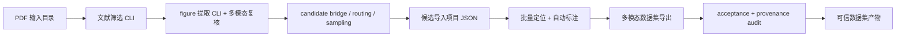

# Formica-Flow 代码智能体全流程接入可行性评估

结论：在“自动定位模型和自动标注模型已经足够好、常规样本不需要人类再干预标注”的前提下，Formica-Flow 可以全面接入代码智能体，但正确形态不是让智能体去点 Qt GUI，而是让它作为 headless 流水线编排者、审计者和异常分流者。当前项目已经具备约 70%-80% 的基础，最缺的是把几个 GUI worker / Python class 提升为稳定 CLI，并补齐从 PDF 候选到项目 JSON、再到多模态数据集 JSONL 的机器可读契约。

## 我在测试项目里补的内容

- `AntSleap/config/agentic_pipeline_contract.json`：定义智能体可读的全流程契约、阶段、输入、产物和质量门。
- `tools/agentic/run_agentic_pipeline.py`：读取契约并生成 dry-run 计划；后续也可以只执行已经 ready 的 command 阶段。
- `tools/agentic/screen_pdfs.py`：把文献筛选 V2 包成 headless CLI，输出独立 `run_index.json`。
- `tools/agentic/extract_figures.py`：把三视图 figure 提取包成 headless CLI，输出 DB 和提取运行索引。
- `tools/agentic/import_candidates_to_project.py`：把治理后的 PDF 候选图片导入项目 JSON，并写入 `image_provenance`。
- `tools/agentic/auto_annotate_project.py`：把批量自动标注写回项目的逻辑包成 CLI；默认可用预测 JSON 测试写回，生产时用 `--run-engine` 初始化真实模型。
- `tools/agentic/export_multimodal_dataset.py`：把已有 `ProjectManager.export_multimodal_dataset()` 包成 headless CLI，并输出 `export_summary.json` 做引用完整性检查。
- 本文档：给出接入判断、改造路线和风险边界。

可以先运行：

```bash
python tools/agentic/run_agentic_pipeline.py --dry-run
```

它会生成：

```text
artifacts/agentic_pipeline/agentic_run_plan.json
```

## 分阶段可行性

| 阶段 | 当前基础 | 可行性 | 主要缺口 |
| --- | --- | --- | --- |
| 文献筛选 | 已新增 headless CLI；原有 V2、续跑、PDF 超时、raw response 保存仍复用 | 高 | 生产运行仍需真实 PDF 目录和 LLM/API 配置 |
| PDF figure 提取 | 已新增 headless CLI；`EnhancedPDFExtractionSystem` 继续负责 figure-region candidate 与证据表 | 高 | 生产运行需明确 multimodal config 或显式禁用多模态复核 |
| 候选桥接/治理 | `tools/governance/run_core2_pipeline.py`、acceptance suite、routing、sampling 已存在 | 很高 | 已可被智能体直接调用，属于当前最成熟自动化岛 |
| 候选导入项目 | 已新增 candidate import adapter，并在项目 JSON 保存 `image_provenance` | 高 | 后续可继续细化 accepted/review 阈值策略 |
| 批量自动标注 | 已新增写回/校验 CLI；可用 `--predictions` 测试，生产可用 `--run-engine` 调模型 | 高 | 仍需在真实 GPU/权重环境做小批量生产验证 |
| 多模态数据集导出 | 已新增 headless CLI 和 `export_summary.json` 完整性检查 | 很高 | 下一步补 source lineage、model provenance 到每条 JSONL |
| 最终审计 | governance 已有 acceptance summary | 高 | 需要把 PDF、项目、模型、导出样本串成一个 final audit package |

## 推荐目标架构



智能体负责：

- 读取契约，检查输入和历史产物。
- 按阶段运行工具，失败后保留 run index 和日志。
- 对缺失、mock、低置信、重复、schema drift 做分流。
- 只在质量门通过后推广到下一阶段。
- 产出最终 Markdown/JSON 审计报告。

模型负责：

- 定位、分割、局部专家推理。
- 多模态 figure 判定和文本/图像一致性复核。

项目代码负责：

- 可复现数据变换。
- 文件、数据库、项目 JSON、导出 JSONL 的稳定 schema。
- 不依赖 GUI 状态的批处理入口。

## 为什么不是让智能体操控整个 GUI

GUI 适合研究者交互，不适合作为大规模自动化控制面。让智能体点击按钮会带来窗口状态、语言主题、对话框阻塞、焦点、长任务中断等不稳定因素。这个项目已有后端类和治理脚本，应该把它们升格为 headless tools，让智能体调用命令、读写 JSON、检查 gate。这样更接近可复现科研流水线，也更容易定位错误。

## 最小可落地改造路线

1. 固化 `agentic_pipeline_contract.json`，把它视为智能体和项目之间的接口。
2. 已补文献筛选 CLI：输入 PDF 目录、输出目录、profile/config、API 设置，输出 `run_index.json`。
3. 已补 figure 提取 CLI：输入 PDF 目录、DB 路径、multimodal config，输出 DB 和提取 run index。
4. 已补 candidate import adapter：从 `routing_decisions.json` 和候选 artifact/DB 中导入可信 figure，写入 project JSON，并保留 PDF/page/figure/candidate provenance。
5. 已新增 batch auto-annotation CLI：可以加载预测 JSON 或用 `--run-engine` 调 `AntEngine.predict_full_pipeline()`，并批量写回 labels、boxes、auto_boxes、descriptions 和 report。
6. 已扩展 multimodal export CLI：当前能导出、写入 schema/run/provenance 字段并校验引用。
7. 最后让智能体执行契约，生成 final audit package，而不是凭聊天上下文判断“应该已经成功”。

## 关键风险

- 坏 PDF、扫描 PDF、重复下载文献仍会出现，智能体必须分流而不是硬吞。
- mock/default multimodal review 只能进入候选或诊断，不能进入可信训练集。
- 自动标注模型再强，也需要产物级校验：空 mask、越界 polygon、重复图片、错误视角、schema 缺字段都应阻断。
- 费用和速率限制要进入 run index，否则大批量文献会很难复盘。
- 数据 lineage 是核心：最终 JSONL 的每一行都应能追溯到 PDF、页码、figure、项目图片、模型版本和导出版本。

## 总体判断

可以做，而且这个项目很适合做。当前已经补上文献筛选 CLI、figure 提取 CLI、candidate import、批量自动标注写回 CLI 和多模态导出 CLI。剩下最关键的是在真实模型/真实 PDF 小批量上做生产验证，以及生成最终审计报告。补完后，代码智能体就可以比较自然地掌控从文献输入到多模态数据集产出的全流程，并用治理脚本把冒进动作拦住。
