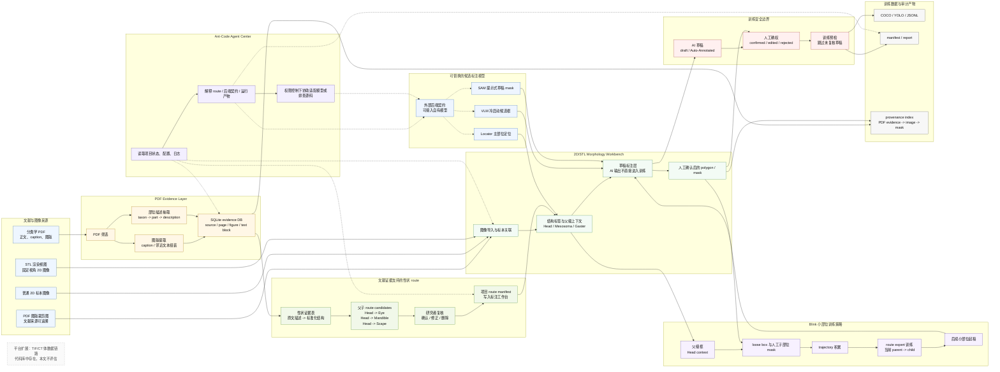

# Figure 1 总流程图草案

## 图题建议

Figure 1. TaxaMask 第一篇验证链路：从分类学文献证据到蚂蚁形态标注训练数据集。

## 图注草案

TaxaMask 将分类学 PDF 中的图版、caption/邻近文本和部位描述整理为可追溯 evidence layer，并将文献证据支持的结构关系转化为 `parent -> child` route。经研究者确认后，route 被写入 2D/STL 标注工作台；VLM、Locator 和 SAM 负责候选起稿，Blink 作为小部位父级上下文训练策略积累 trajectory 并训练 route expert。所有 AI 输出保持为草稿，只有人工确认后的标注进入训练集导出。Ant-Code Agent Center 横跨以上阶段，读取项目状态、配置、日志、后端契约和源码线索，协助诊断与适配，但不替代人工确权。TIF/CT 体数据链路属于平台扩展，本文不评估。

## Mermaid 草图

