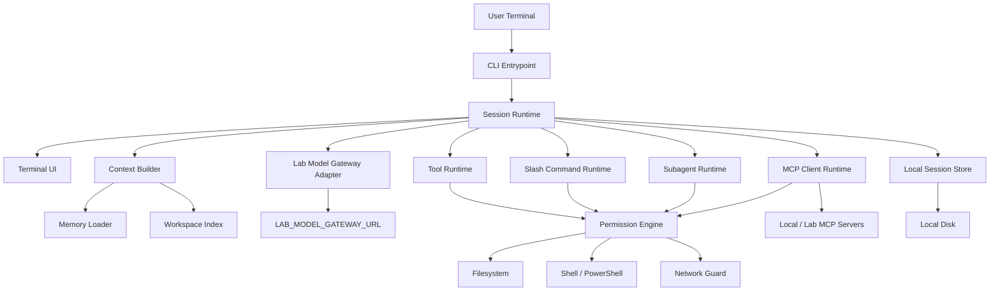

# MVP Architecture

This document describes the clean-room MVP architecture for the new lab-owned code assistant.

## Architecture Goals

- Clean-room implementation.
- Local-first operation.
- Lab model gateway as the only model transport.
- Strong permission and data-boundary enforcement.
- Small core with explicit extension points.
- No dependency on Claude.ai private services.
- Easy deployment to 100+ lab users.

## High-Level Diagram



## Runtime Components

### CLI Entrypoint

Responsibilities:

- parse CLI arguments
- resolve working directory
- load environment
- initialize config
- choose interactive or print mode; no-argument startup enters interactive mode
- start session runtime

Non-responsibilities:

- model request construction
- tool execution
- policy decisions

### Session Runtime

Responsibilities:

- own session lifecycle
- prepend clean-room system context to model turns
- maintain conversation state
- enforce a configurable context budget
- compact older messages into bounded, redacted, process-local summaries
- inject bounded workflow context for follow-up repair turns
- derive delivery status and next-action hints from workflow state
- derive task lifecycle stage and stale-validation detection from workflow state
- invoke model gateway
- dispatch tool calls
- apply compaction
- handle interrupts
- write transcript according to policy

Session runtime is the central orchestrator. It should be small and protocol-driven.

### Model Gateway Adapter

Responsibilities:

- convert internal message format to lab gateway request
- stream model output
- parse tool calls
- send tool results
- expose provider-independent errors

Rules:

- local client never stores provider API keys
- local client never calls provider APIs directly
- gateway URL must pass network policy
- request metadata must exclude secrets

### Context Builder

Responsibilities:

- assemble system prompt components
- assemble behavior and final-response protocol
- include memory files
- include workspace summary
- include active policy summary
- include tool schemas
- manage context budget

MVP context sources:

- lab rules
- user memory
- project memory
- behavior protocol
- session state
- selected files
- tool results

### Tool Runtime

Responsibilities:

- register built-in tools
- validate tool input
- call permission engine
- execute tool handler
- normalize tool result
- record audit events

Tool handlers must be stateless or request-scoped whenever possible.

### Permission Engine

Responsibilities:

- decide allow / ask / deny
- merge policy sources
- protect workspace boundary
- classify shell commands
- scrub subprocess env
- enforce network mode
- record approvals

Decision sources, highest precedence first:

1. hardcoded safety denylist
2. lab managed policy
3. project policy
4. user policy
5. session approvals
6. default policy

### MCP Client Runtime

Responsibilities:

- launch local stdio MCP servers
- connect to approved HTTP/SSE MCP servers
- list tools/resources
- route MCP tool calls through permission engine
- scrub MCP server environment

MCP runtime must not auto-discover Claude.ai connectors.

### Slash Command Runtime

Responsibilities:

- parse slash commands
- load command definitions
- interpolate arguments
- execute command handlers
- support project and user commands

Slash commands are not allowed to bypass permissions.

### Subagent Runtime

Responsibilities:

- create isolated child context
- enforce agent-specific tool allowlist
- run child turn loop
- return summarized result to parent
- propagate cancellation

MVP subagents are local only. No cloud scheduling.

### Local Session Store

Responsibilities:

- store session metadata
- store transcript if enabled
- store todos and plans
- enforce retention and encryption policy
- avoid writing secrets when detected

## Data Model

### Session

```ts
type Session = {
  id: string
  cwd: string
  startedAt: string
  mode: 'interactive' | 'print'
  turnCount: number
  networkMode: 'offline' | 'lab-only' | 'approved-web' | 'open-dev'
  sensitivity: 'standard' | 'high'
  model: string
  transcriptPolicy: TranscriptPolicy
  messages: Message[]
  contextWindow: {
    maxMessages: number
    maxBytes: number
    keepRecentMessages: number
    summaryBytes: number
    compactionCount: number
    compactedMessages: number
  }
  workflow: {
    todos: WorkflowItem[]
    plan: { explanation: string; steps: WorkflowItem[] }
    changes: ChangeRecord[]
    validations: ValidationRecord[]
  }
}

type WorkflowItem = {
  id: string
  content: string
  status: 'pending' | 'in_progress' | 'completed' | 'cancelled'
}

type ChangeRecord = {
  id: string
  toolName: string
  path: string
  created: boolean
  edited: boolean
  diffBytes: number
  diffTruncated: boolean
}

type ValidationRecord = {
  id: string
  toolName: string
  command: string
  exitCode: number | null
  passed: boolean
  timedOut: boolean
  durationMs: number | null
  failureContext?: {
    commandCategory: string
    stdoutExcerpt: string
    stderrExcerpt: string
    stdoutTruncated: boolean
    stderrTruncated: boolean
  }
}
```

Conversation resume restores the local session id, start time, turn index, and bounded retained user/assistant transcript when transcript retention is enabled. Persisted transcript text is redacted for common secret/path patterns, excludes tool result bodies, and is skipped entirely when transcript retention is disabled or high-sensitivity policy forces zero retention.

Context compaction summaries may be retained as redacted local resume context under the transcript retention policy. Persisted metadata also stores counts, byte totals, compaction counts, and timestamps; it does not store raw tool outputs.

Failed validation `failureContext` is process-local follow-up context. It is redacted before model submission and excluded from persisted metadata, which stores only validation counts/status summaries.

Delivery status is a derived view over workflow state. It is shown in the terminal and slash commands, not persisted as a separate source of truth.

Task lifecycle is a derived view over workflow state with stages `inspect`, `plan`, `edit`, `validate`, `repair`, and `ready`. A passing validation only permits the `ready` stage when it is newer than the latest recorded file change, when timestamps are available.

### Message

```ts
type Message =
  | { role: 'system'; content: ContentBlock[] }
  | { role: 'user'; content: ContentBlock[] }
  | { role: 'assistant'; content: ContentBlock[]; toolCalls?: ToolCall[] }
  | { role: 'tool'; toolCallId: string; content: ContentBlock[] }
```

### Tool

```ts
type ToolDefinition = {
  name: string
  description: string
  inputSchema: JsonSchema
  outputSchema?: JsonSchema
  risk: 'read' | 'write' | 'execute' | 'network'
}
```

### Policy Decision

```ts
type PolicyDecision =
  | { decision: 'allow'; reason: string }
  | { decision: 'ask'; reason: string; prompt: string }
  | { decision: 'deny'; reason: string }
```

## Network Modes

| Mode | Allowed network |
| --- | --- |
| `offline` | loopback only |
| `lab-only` | lab gateway, lab config, lab registry, lab MCP |
| `approved-web` | lab endpoints plus explicit allowlist |
| `open-dev` | broader network for non-sensitive development |

Default: `lab-only`.

## Error Handling

Errors should be normalized into:

- user-correctable
- policy-denied
- model-gateway
- tool-runtime
- filesystem
- shell
- mcp
- internal

Each error must include:

- stable code
- user-facing message
- optional debug details
- redaction status

## Forbidden Runtime Dependencies

Runtime code must not include:

- direct Claude.ai OAuth
- direct `api.anthropic.com/api/claude_code/*`
- `/v1/sessions` cloud session client
- `/v1/code/*` cloud session client
- GrowthBook
- Statsig
- Datadog
- transcript upload
- official marketplace auto-install

## Reviewed Runtime Dependency Policy

Runtime dependencies are allowed only when they are reviewed as public open-source inputs and recorded in release evidence.

Current reviewed runtime dependencies:

| Package | Purpose | License | Review boundary |
| --- | --- | --- | --- |
| `ink` | Terminal UI rendering | MIT | Public npm package; used only for the local Ant Code TUI surface |
| `katex` | Dashboard math rendering | MIT | Public npm package; bundled into local Dashboard assets, no CDN |
| `mermaid` | Dashboard diagram rendering | MIT | Public npm package; bundled into local Dashboard assets, no CDN |
| `react` | Ink UI component runtime | MIT | Public npm package; used only by the local Ant Code TUI surface |
| `yaml` | Dashboard YAML parsing for structured previews | ISC | Public npm package; used only for local Markdown/data rendering |

Release checks must reject unreviewed runtime dependencies, non-registry dependency specs, install-time package scripts, missing lockfile integrity, missing SBOM evidence, or missing module provenance notes.

## MVP Deployment Model

Recommended deployment:

- package as Node.js executable or single JS bundle
- config directory under lab-owned app name
- project-local config file
- lab policy distributed by Git or internal HTTPS endpoint
- lab gateway URL injected by managed config

No auto-update in MVP. Updates should come from lab package channel.
