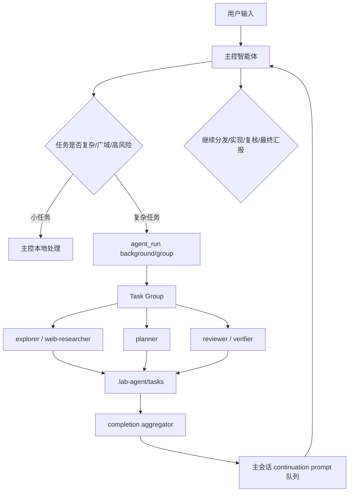

# 子智能体后台唤醒主控编排升级计划

状态：已完成并准备归档（2026-05-05）  
创建日期：2026-05-05  
适用仓库：`C:\saveproject\LBJ-workspace\lab-agent`  
最近确认的 git 回档点：`d7762ea checkpoint: before delegation guard orchestration upgrade`

## 完成摘要

本计划已按用户确认执行完毕，并在实现后做了二轮严格审查和补漏。

实际落地：

- `agent_run` 支持 `background`、`groupId`、`waitForGroup`、`wakeParent`、`wakeReason`。
- 新增 `.lab-agent/task-groups/` 任务组记录，支持 `waitFor=all/any/none`。
- 后台子任务完成后生成短 continuation prompt，并在 TUI 空闲时自动续跑主控，忙时进入队列。
- 主 turn 中断不杀后台子任务；TUI 退出前会确认并先停止后台任务。
- 增加 `/agents groups`、`/agents group`、`/agents wake`、`/agents cancel-group`。
- 右侧“子智能体”面板顶部按任务组聚合展示运行、完成和唤醒状态，同时保留单任务明细。
- 增加 `review gate`，最终回答前提醒 reviewer/verifier；修复普通 `token=...` 文本误触发额外模型轮次的问题。
- 新增 hooks：`subagent.group.started`、`subagent.group.completed`、`subagent.group.wakeup_queued`、`review.gate`。

补充审查修正：

- `waitForGroup=any` 现在按第一条终态任务唤醒，不再实际等同 `all`。
- `/agents cancel-group` 会中止当前进程内匹配 group 的后台 controller，而不只是改 JSON 状态。
- 后台 task record 写入 `groupId`，方便 UI 和后续诊断定位。

最终验证：

```powershell
npm run check
```

结果：语法检查、禁用端点扫描、来源校验、依赖策略和全量测试全部通过；`484 pass / 0 fail`。

## 一句话目标

在现有 agent 系统基础上，把 `agent_run` 从“同步工具结果返回给当前生成轮次”升级为“可后台运行、可成组等待、完成后自动以 continuation prompt 唤醒主控”的调度闭环，让主智能体更像长期调度器，而不是被迫在同一轮回答中急着自己完成所有工作。

## 背景和问题

当前 Ant Code 已具备：

- `agent_run` one-shot 子智能体。
- 只读子智能体同批并行执行能力。
- 子任务 JSON 记录：task id、child session id、profile、状态、工具摘要、预算进度、输出摘要。
- TUI 右侧“子智能体”面板和双击摘录详情。
- `/background run` 手动后台任务。
- 主控 prompt 和 delegation guard，会提醒主控把广域搜索、广域读代码、联网调研交给子智能体。

但当前核心短板是调度语义：

- 模型调用 `agent_run` 后，子任务结果会作为同一轮工具结果返回给主控。
- 主控仍处于同一个 assistant turn 的生成过程中，需要马上决定继续调用工具还是最终回答。
- 这会让部分模型倾向于“尽快自己收尾”，而不是等待 reviewer、verifier、web-researcher 等后台慢任务慢慢完成。
- reviewer 这类末端复核任务尤其容易被省略，因为主控在同一轮里已经形成了回答冲动。
- 长任务中，主控自己连续 `web_search` / `web_fetch` / `grep` / `read_file` 会消耗强模型上下文和 tokens，削弱子智能体协作价值。

用户观察和判断：

- OMO 类主控在子智能体运行时通常不会继续生成长答案，而是结束当前阶段并等待子任务结果。
- 子任务完成后，结果会像一条新 prompt 一样回到主控，主控被再次触发，继续汇总、更新 todo、决定下一批分发或最终回答。
- 这种机制更适合长任务、多子智能体、严格复核和低成本模型分工。

## 参考结论

### opencode 可借鉴点

- primary agent 与 subagent 职责清晰。
- subagent 是独立 child session，可配置模型、权限和模式。
- 子任务可以被主控自动调用，用户可进入 child session 查看细节。
- 主控负责整合子任务结果，而不是把所有原始工具输出堆在主会话。

Ant Code 吸收方式：

- 保留现有 profile、task store、TUI 任务面板。
- 不迁移 opencode UI 栈。
- 借鉴 child task / parent continuation 的交互语义。

### oh-my-openagent / OMO 可借鉴点

- 主控是长期调度器，负责分发、等待、回收、汇总和继续推进。
- 并行只读子任务完成前，主控可结束当前响应，等待后续唤醒。
- 子任务结果以模型可见输入形式回到主控，而不是只写日志。
- 高风险或重要任务有复核角色参与。

Ant Code 吸收方式：

- 不照搬角色命名、人设和外部依赖。
- 在现有 `agent_run` 和 `/background` 机制上增加后台唤醒闭环。
- 默认仍保持用户可见、可取消、可追踪，不做黑箱后台自动化。

## 本轮做什么

1. 给模型可调用的 `agent_run` 增加后台运行语义。
2. 增加 task group，用于管理同一批并行子任务。
3. 子任务完成后自动生成 continuation prompt，排队唤醒主控。
4. 主控被唤醒后能看到子任务摘要、失败/暂停原因、任务 id 和下一步建议。
5. 对复杂任务增加 review gate：最终回答前如缺少必要 reviewer/verifier 结果，提醒或自动要求先派发复核。
6. TUI 显示“子任务组运行中 / 已完成 / 已唤醒主控”，并在任务面板中按组展示。
7. 增加配置项、测试、日志和维护文档。

## 本轮不做什么

- 不推翻现有 agent profile 体系。
- 不移除同步 `agent_run`，保留给短任务和兼容路径。
- 不让子智能体递归调用子智能体。
- 不让后台任务绕过现有权限模式。
- 不默认硬拦主控直接读文件或联网；强制行为只用于明确的 review gate 或用户配置。
- 不在计划或代码中写入 API key、GitHub token、网关 key。
- 不引入 opencode/OMO 依赖包。

## 目标架构



## 核心设计

### 1. `agent_run` 增加后台参数

扩展工具输入：

```json
{
  "profile": "explorer",
  "query": "只读排查 src 下的数据流入口",
  "background": true,
  "groupId": "group-...",
  "waitForGroup": "all",
  "wakeParent": true,
  "wakeReason": "需要整合探索结果后继续规划"
}
```

建议字段：

- `background: boolean`：是否立即返回 task id，让子任务在后台继续。
- `groupId: string`：同批任务归组；缺省时运行时生成。
- `waitForGroup: "all" | "any" | "none"`：何时唤醒主控。
- `wakeParent: boolean`：子任务完成后是否自动排队 continuation prompt。
- `wakeReason: string`：写入 continuation prompt 的调度原因。

默认策略：

- 模型没有传 `background` 时，保持现有同步行为。
- “同步行为”指：`agent_run` 作为普通工具调用执行，主控当前 turn 会等待子智能体完成，然后把子智能体结果作为 tool result 交回同一轮模型生成；这适合短小、明确、需要马上拿结果的子任务。
- 主控 prompt 推荐复杂任务使用 `background: true`。
- `/agents run` 默认仍同步或按当前交互执行，避免用户命令行为突然变化。
- `/background run` 可以复用新的 group/wakeup 后端。

### 2. Task Group 记录

新增轻量任务组记录，存放在 `.lab-agent/task-groups/<groupId>.json`，或复用 task store 的 root task：

```json
{
  "id": "group-...",
  "parentSessionId": "...",
  "status": "running",
  "waitFor": "all",
  "wakeParent": true,
  "taskIds": ["task-a", "task-b"],
  "createdAt": "...",
  "updatedAt": "...",
  "completedAt": null,
  "wakePromptQueuedAt": null,
  "summary": ""
}
```

设计要求：

- 任务组只负责聚合状态，不替代单个 task record。
- 子任务完成、失败、暂停、取消都要更新 group。
- `waitFor=all` 时，全部达到终态后唤醒主控。
- `waitFor=any` 可用于竞速搜索，第一条子任务进入终态即可触发组完成判断；如终态是失败/阻止，则组状态为 partial。

### 3. Completion Aggregator

新增聚合器逻辑：

- 监听 `subagent.completed` / `subagent.failed` / `subagent.paused` / `subagent.interrupted` 等结果。
- 读取同组任务记录。
- 生成一个模型可见 continuation prompt。
- 把 prompt 插入 TUI 队列或 session 队列。

continuation prompt 示例：

```text
[Ant Code subagent group completed]
groupId: group-...
parentSessionId: ...

以下后台子任务已达到等待条件，请作为主控继续处理：
- task-a explorer completed: ...
- task-b planner completed: ...
- task-c reviewer paused: ...

请：
1. 整合可用结果，不要原样粘贴子任务 JSON。
2. 更新 todo/plan。
3. 如结果不足，派发更小的后续子任务或说明需要用户确认。
4. 如已满足交付条件，给出最终汇报。
```

关键要求：

- continuation prompt 必须进入模型上下文，不能只放 `/logs`。
- prompt 要短，主要放摘要、task id、状态和下一步约束。
- 完整子任务输出仍留在任务详情/摘录层，避免主会话吞掉大量上下文。

### 4. 主控等待语义

主控 prompt 新增明确策略：

- 派发后台子任务后，如果没有不重叠的本地工作，就不要继续长篇回答。
- 可以简短告诉用户“已启动 N 个后台子任务，完成后我会继续整合”。
- 不要把“等待子任务”误解为任务中断；后台任务会继续运行。
- 子任务结果回填时，把它当作新的用户/系统输入继续工作。

这解决当前“时刻回答机制”：

- 旧机制：模型派发子任务 -> 同轮继续生成 -> 容易自己收尾。
- 新机制：模型派发后台子任务 -> 当前轮短状态结束 -> 子任务完成后新 prompt 唤醒 -> 再综合判断。

### 5. Review Gate

增加轻量复核门：

触发条件：

- 本轮有写入文件。
- todo 数量 >= 4。
- 用户任务包含“审计、重构、安全、发布、严格审核、全面排查”等。
- 子任务或主控执行出现 partial/blocked/tool failure。
- 修改范围跨多个目录。

策略：

- 默认 `mode: "remind"`：最终回答前提醒主控需要 reviewer/verifier。
- 可选 `mode: "require"`：高敏模板中可以要求先完成 reviewer/verifier 后再最终回答。
- 用户可在配置中关闭。

提醒写入模型可见上下文：

```text
[Ant Code review gate]
当前任务满足复核条件，但尚未看到 reviewer/verifier 结果。
最终回答前请优先运行 reviewer 或 verifier；如果跳过，请说明具体理由。
```

### 6. TUI 交互

聊天区：

- `子任务组已启动：3 个后台任务运行中，完成后将自动唤醒主控。`
- `子任务组已完成：2 成功，1 暂停；已排队主控继续处理。`
- 双击任务卡进入摘录详情。

右侧栏：

- “子智能体”面板按任务组聚合展示。
- active 分类优先显示 running group。
- issue 分类显示 failed/paused/blocked group。
- completed 分类显示完成组。

队列：

- 自动回填的 continuation prompt 应显示为“系统续跑提示已排队”，但不刷屏显示完整长 prompt。
- 如果 TUI 空闲，后台 group 完成后自动运行 continuation prompt，继续主控进程，不等待用户按 Enter。
- 如果 TUI 正忙，continuation prompt 进入队列，当前 turn 结束后自动衔接执行。
- 用户仍可用 `/queue` 查看和调整尚未运行的续跑提示。

中断/退出：

- 用户中断主 turn 不应误杀后台子任务，除非明确取消 group。
- TUI 退出时，如果仍有后台任务运行，必须进入退出确认框，提示“仍有 N 个后台子任务运行；确认退出会先停止所有任务”。
- 用户确认退出后，不立即结束进程；先向所有后台 task/group 发送取消信号，任务状态显示为“退出中/取消中”。
- 由于 `Ctrl+C` 两次退出的时间间隔很短，第二次 `Ctrl+C` 在后台任务未完全停止时不能强制直接退出，而是显示“后台任务退出中，请等待任务完全停止”。
- 所有后台任务都进入 completed/failed/partial/cancelled/interrupted 等终态后，聊天区提示“后台任务已停止，可以再次退出”，此后才允许彻底退出。

## 配置设计

建议新增：

```json
{
  "agents": {
    "backgroundWakeup": {
      "enabled": true,
      "defaultForModelAgentRun": false,
      "maxConcurrentBackground": 3,
      "defaultWaitFor": "all",
      "autoQueueParentPrompt": true,
      "maxWakeSummaryBytes": 12000
    },
    "reviewGate": {
      "enabled": true,
      "mode": "remind",
      "todoThreshold": 4,
      "requireForWrites": false,
      "requireForHighRisk": false
    }
  }
}
```

第一阶段建议：

- `backgroundWakeup.enabled=true`
- `defaultForModelAgentRun=false`，由 prompt 引导模型显式传 `background:true`
- `reviewGate.mode="remind"`，不硬阻断用户长任务

## 执行清单

### Stage 1：补充计划和测试基线

状态：已完成

内容：

- 新增本计划文档。
- 更新 `docs/plans/README.md` 当前待审计划。
- 为后续实现先补充单元测试骨架或明确测试文件列表。

验收：

- 文档在 `docs/plans/active/`。
- README 能看到本计划。
- 未改运行逻辑。

### Stage 2：扩展工具 schema 和配置加载

状态：已完成

文件：

- `src/tools/definitions.js`
- `src/config/load-config.js`
- `lab-agent.config.json`
- `config/lab-agent.lab-template.json`
- `config/lab-agent.high-sensitivity-template.json`
- `tests/unit/config.test.js`

内容：

- 给 `agent_run` 输入 schema 增加 `background`、`groupId`、`waitForGroup`、`wakeParent`、`wakeReason`。
- 增加 `agents.backgroundWakeup` 和 `agents.reviewGate` 默认配置。
- 保持旧配置兼容。

验收：

- `npm run check` 通过。
- 未传新字段时旧测试不变。

### Stage 3：实现 Task Group Store

状态：已完成

文件：

- 新增 `src/agents/task-group-store.js`
- `tests/unit/agent-task-group-store.test.js`

内容：

- 创建/读取/更新/list task group。
- 支持 group taskIds、状态聚合、wakePromptQueuedAt。
- 安全校验 group id。
- 容忍损坏记录在列表中跳过，但直接读取时报错。

验收：

- 单测覆盖 create/update/list/read。
- group 状态能从子 task 状态聚合为 running/completed/partial/failed/cancelled。

### Stage 4：后台 `agent_run` 运行时

状态：已完成

文件：

- `src/tools/runtime.js`
- `src/agents/runner.js`
- `src/core/session.js`
- `tests/unit/tools.test.js`
- `tests/unit/session.test.js`

内容：

- `agent_run background:true` 先完成权限检查，再创建 task/group 并启动后台 Promise。
- 立即向模型返回 taskId/groupId/状态说明。
- 后台子任务继续写 task record。
- 同批多个 readonly background agent_run 归入同一 group。
- 同步 agent_run 逻辑保持不变。

验收：

- 模型调用 background agent_run 后，当前 tool result 立即返回“已启动”。
- task record 随后台执行更新。
- 旧同步并行 `agent_run` 测试仍通过。
- 中断当前主 turn 不应导致已启动后台任务记录丢失。

### Stage 5：主控自动唤醒队列

状态：已完成

文件：

- 新增 `src/agents/wakeup.js`
- `src/cli/tui.js`
- `src/agents/task-group-store.js`
- `tests/unit/agents-wakeup.test.js`
- `tests/unit/tui-workflows.test.js` 或相关 TUI 单测

内容：

- group 达到等待条件后生成 continuation prompt。
- TUI 收到 wakeup 后插入 queued prompt。
- 如果 TUI 当前 busy，排队等待；如果空闲，自动运行该 continuation prompt，继续主控进程。
- 防重复：同一 group 只能 queue 一次，除非用户手动 `/agents continue`。

验收：

- 后台 group 完成后，队列出现一条系统续跑提示。
- 主控自动继续时，聊天区显示“子任务组完成，主控继续处理”，用户不需要额外按 Enter。
- 重启 TUI 后不会重复唤醒已 queue 的 group。

### Stage 6：主控 prompt 和 profile prompt 更新

状态：已完成

文件：

- `src/context/builder.js`
- `src/agents/profiles.js`
- `tests/unit/context.test.js`

内容：

- 主控增加“派发后等待”的明确规则。
- 复杂任务推荐 `background:true` + `groupId` + `wakeParent:true`。
- reviewer/verifier 的触发时机写清楚。
- 子智能体 prompt 增加：返回结构化摘要，避免输出过大 JSON。

验收：

- system prompt 中有明确“background subagent wakeup / wait for child results”语义。
- 小任务仍提示可本地处理。

### Stage 7：Review Gate

状态：已完成

文件：

- 新增或扩展 `src/agents/review-policy.js`
- `src/core/session.js`
- `src/agents/delegation-guard.js` 或独立 guard
- `tests/unit/review-policy.test.js`
- `tests/unit/session.test.js`

内容：

- 检测写入、多 todo、高风险 prompt、partial/blocked 子任务等复核信号。
- 最终回答前如果缺少 reviewer/verifier，向模型可见上下文注入提醒。
- 默认 remind，不硬拦截。

验收：

- 多文件写入/高风险任务会产生 review gate 提醒。
- 单文件小任务不误触发。
- 用户配置关闭后不触发。

### Stage 8：TUI 任务组展示和摘录详情

状态：已完成

文件：

- `src/cli/tui/components.js`
- `src/cli/tui/command-panels.js`
- `src/cli/tui/format.js`
- `tests/unit/tui-command-panels.test.js`
- `tests/unit/tui-format.test.js`

内容：

- 右侧子智能体面板按 group 聚合显示。
- 聊天卡显示 group 运行、完成、唤醒状态。
- 双击 group/task 进入详情摘录层。
- 详情中展示 task id、profile、状态、工具摘要、输出摘要、完整输出入口。

验收：

- 用户能看出后台任务还活着。
- 完成后能看出主控已被唤醒或已排队。
- 不破坏现有消息摘录和复制体验。

### Stage 8.5：后台任务退出保护

状态：已完成

文件：

- `src/cli/tui.js`
- `src/agents/task-group-store.js`
- `src/agents/task-store.js`
- 相关 TUI 交互测试

内容：

- 当后台 task/group 仍在运行时，`/exit` 或 `Ctrl+C` 触发退出确认框。
- 确认退出后先取消所有后台任务，而不是直接关闭 TUI 进程。
- 取消过程中聊天区和 activity 显示“后台任务退出中”。
- 后台任务完全进入终态后，聊天区提示“后台任务已停止，可以再次退出”。
- 后台任务未停止前，连续第二次 `Ctrl+C` 只刷新提示，不强行退出。

验收：

- 有后台任务时不能绕过确认直接退出。
- 确认退出后能看到任务取消中状态。
- 任务完全停止前不能彻底退出。
- 任务停止后再次 `/exit` 或 `Ctrl+C` 可以正常退出。

### Stage 9：Slash 命令补充

状态：已完成

文件：

- slash command 处理相关文件
- command panel/help 相关文件
- `tests/unit/commands.test.js`

建议命令：

- `/agents groups`：列出任务组。
- `/agents group <group-id>`：查看组详情。
- `/agents cancel-group <group-id>`：取消组内仍运行任务。
- `/agents wake <group-id>`：手动生成 continuation prompt。

验收：

- 命令中文说明清晰。
- `/help` 能查到。
- 错误 group id 有明确提示。

### Stage 10：Hooks、日志和文档

状态：已完成

文件：

- `src/hooks/events.js`
- `src/hooks/builtins.js`
- `src/hooks/registry.js`
- `PROJECT_CHANGELOG.zh-CN.md`
- `LLM_ONBOARDING.md`
- 本计划文档状态

新增事件：

- `subagent.group.started`
- `subagent.group.completed`
- `subagent.group.wakeup_queued`
- `review.gate`

验收：

- `/logs` 能看到 group 生命周期。
- changelog 记录本次升级。
- onboarding 说明新机制和开发坑点。

### Stage 11：严格审查和实机验收

状态：已完成

内容：

- 跑 `npm run check`。
- 多视角审查：
  - 权限链路。
  - 子任务生命周期。
  - TUI 状态一致性。
  - 上下文占用。
  - 失败/暂停/取消路径。
  - 回档风险。
- 给用户提供实机验收提示词。

验收提示词建议：

```text
只读模式，不要修改文件。请全面排查当前项目的组件架构、数据流、权限/认证/token/fetch/storage 相关风险，并给出最值得优化的 5 个问题，要求包含文件路径和证据。
```

预期现象：

- 主控先创建 todo/plan。
- 主控启动 2-3 个后台子任务，而不是自己连续大范围读代码。
- 聊天区出现子任务组启动提示。
- 右侧子智能体面板动态更新。
- 子任务完成后自动排队/触发主控继续整合。
- 最终回答前，如任务高风险，应看到 reviewer/verifier 或 review gate 提醒。

## 风险和缓解

### 风险 1：后台任务和主 turn 生命周期互相干扰

缓解：

- 后台任务使用独立 AbortController。
- 主 turn 中断不默认取消后台 group。
- group cancel 明确由用户命令触发。

### 风险 2：自动唤醒造成无限循环

缓解：

- 每个 group 默认只唤醒一次。
- continuation prompt 标记 source/groupId。
- 主控若继续派发新 group，必须生成新 groupId。
- 配置最大连续自动唤醒次数。

### 风险 3：主会话上下文被子任务摘要撑大

缓解：

- wake prompt 只放摘要和 task id。
- 完整输出留 task record/摘录层。
- maxWakeSummaryBytes 做硬上限。

### 风险 4：模型仍不使用后台字段

缓解：

- prompt 强化。
- delegation guard 强提醒时建议 `background:true`。
- 后续可考虑配置 `defaultForModelAgentRun=true`，把复杂任务的模型 `agent_run` 默认转后台。

### 风险 5：权限模式被后台绕过

缓解：

- 后台 agent_run 仍先走同一套 `decidePermission`。
- 子任务内部 policy 从父 session 当前权限派生。
- 完全访问、工作区权限、计划确认三条链路都要有回归测试。

## 回滚方案

- 代码级回滚：使用最近 git checkpoint 或本次改造前新建 checkpoint。
- 功能级回滚：配置 `agents.backgroundWakeup.enabled=false`，`agents.reviewGate.enabled=false`。
- 兼容级回滚：未传 `background:true` 时继续走现有同步 `agent_run`。

## 审核问题

请用户重点确认：

1. `agent_run` 默认保持同步，只在 prompt 引导或显式参数下后台运行。已确认。
2. 后台 group 完成后，TUI 空闲时自动继续主控，不等待用户 Enter。已确认。
3. 后台任务仍在运行时退出 TUI，必须确认；确认后先停止所有后台任务，完全停止后才允许真正退出。已确认。
4. review gate 第一版是否只提醒，不硬阻断？
5. 是否需要 `/agents groups` 等命令第一版就完整落地？
