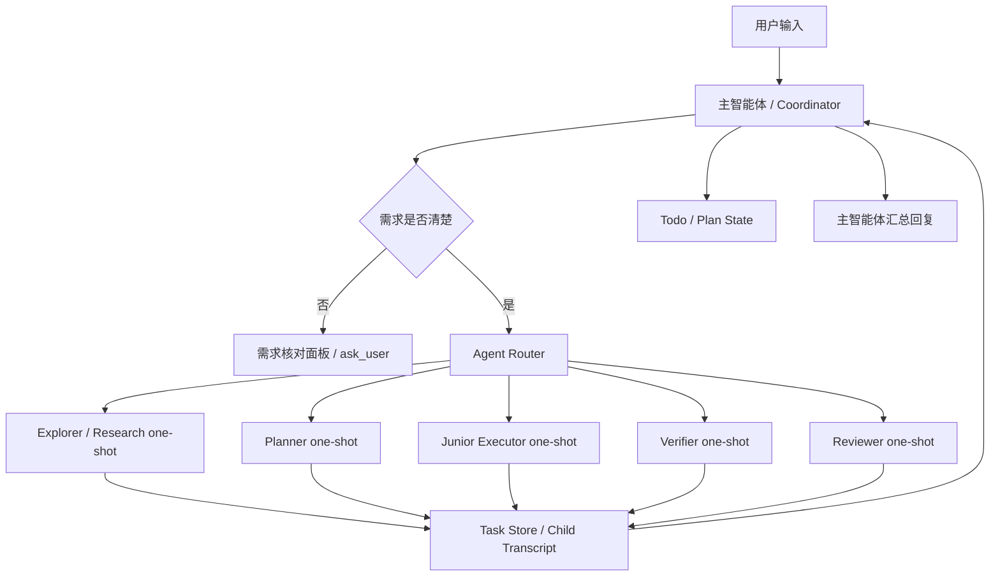
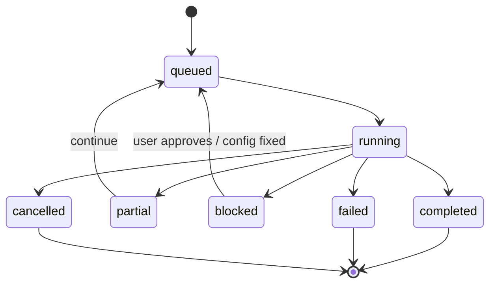

# Ant Code 子智能体编排 v2 架构设计稿

日期：2026-05-01

状态：设计待审核，审核通过前不修改运行逻辑。

适用仓库：

`C:\saveproject\LBJ-workspace\lab-agent`

## 一句话目标

把当前 Ant Code 的子智能体从“可手动调用的 profile 工具”升级为“长上下文主调度器 + one-shot 子任务池 + 难度/风险/成本路由 + 可后台续跑 + 严格复核”的多智能体协作系统。

## 设计背景

当前 Ant Code 已具备：

- `agent_run` 工具。
- 内置 profiles：`explorer`、`readonly-researcher`、`planner`、`verifier`、`code-worker`、`web-researcher`、`browser-verifier` 等。
- 子任务记录：task id、child session id、profile、状态、工具摘要、输出摘要。
- TUI 右侧任务栏和 `/agents tasks`。
- MCP、skill、web、browser、document 能力的基础接入。

当前短板：

- 主智能体虽然知道可以调用 `agent_run`，但缺少稳定的“任务分类 -> profile -> 模型 -> 预算 -> 权限”的路由层。
- 子智能体默认 16 轮工具硬限制，对长任务偏保守，容易在有大量探索或验证步骤时提前失败。
- `code-worker`、`planner`、`verifier`、`reviewer` 类角色边界还不够清晰。
- 子智能体结果没有形成强约束的结构化 contract，主智能体整合时仍依赖模型自由发挥。
- 长任务没有“阶段总结 + 续跑 token + 下一批任务”的一等机制。
- 成本优化不足：轻量任务没有稳定路由到便宜模型，复杂任务没有明确升档规则。

## 参考项目结论

### opencode 的启发

opencode 的 agent 工具偏 one-shot task agent：

- 主智能体发出一次明确任务。
- 子智能体只返回一次结果。
- 子智能体不继承完整长期上下文，避免注意力被历史会话污染。
- task agent 的工具权限很窄，主要负责搜索、读取、定位，不负责自由写代码。
- 适合并行启动多个只读调查任务。

适合 Ant Code 吸收的点：

- 默认 one-shot，任务清晰，结果回收。
- 轻量任务可用便宜模型。
- 只读调查和验证任务可以并行。
- 子智能体不允许继续调用子智能体，避免无限递归。

不直接照搬的点：

- Ant Code 需要保留中文 TUI、profile 化配置和实验室本地网关。
- Ant Code 需要支持写代码型子任务，但必须加写入范围、权限和复核。
- Ant Code 需要支持超长任务的阶段性续跑，而不是一次失败后让用户手动拼接。

### Oh My OpenAgent 的启发

Oh My OpenAgent 的关键价值在于“主调度器 + 专用角色 + 分类路由”：

- 主智能体使用强模型和长上下文，负责全局计划、任务分派、回收汇总和继续推进。
- 子智能体按职责分工，例如计划、执行、严格复核、资料检索。
- 执行型子智能体根据任务难度选择模型：简单任务走便宜模型，高难度任务走强模型。
- 主智能体负责维护 todo，并根据子智能体返回结果继续分发下一批任务。

适合 Ant Code 吸收的点：

- 主智能体是唯一总调度者，不让子智能体自由扩散。
- 引入 Junior 执行器：既能做脏活累活，也能按难度切换模型。
- 引入 Reviewer 复核器：专门挑错、审查计划、检查遗漏和风险。
- 用任务类别和风险级别驱动模型、工具和预算。

不直接照搬的点：

- 不照搬角色人设和命名体系。
- 不引入过度复杂的多层团队树。
- 不让子智能体长期在线聊天。

## 总体原则

1. 主智能体长期、子智能体短命。
   主智能体持有完整上下文和用户目标，子智能体默认 one-shot，只拿完成任务所需的最小上下文。

2. 主智能体负责分派和收束。
   子智能体不能直接推动用户对话结论，必须把结果交给主智能体整合。

3. 默认 one-shot，长任务分段续跑。
   子智能体不做长期聊天会话。长任务通过阶段性总结、续跑提示和任务树继续推进。

4. 轻任务便宜模型，重任务强模型。
   路由层根据任务难度、风险、写入范围、上下文需求和失败代价选择模型。

5. 写操作必须有明确边界。
   写代码型子智能体必须拿到 `writeScope`，不能自由修改未授权区域。

6. 复核和执行分离。
   Reviewer 类复核器默认只读，不写代码，不运行高风险命令，不调用其他 agent。

7. 并行只给安全任务。
   只读探索、资料搜索、验证诊断可以并行。写入型任务默认串行或隔离运行。

8. 所有能力可观察。
   TUI 必须显示任务树、角色、模型、预算、工具状态、阶段总结和失败原因。

9. 所有预算可解释。
   到达限制时不能只报错，要说明触发了什么预算、已经完成什么、下一步如何续跑。

10. 不写入密钥。
   不把网关 key、cookie、token、真实 `.env` 写入仓库或子任务记录。

## 目标架构



## 核心角色设计

### Coordinator：主智能体

定位：

- 长上下文总调度。
- 唯一直接面对用户的智能体。
- 负责维护 todo、计划、任务树和最终结论。

职责：

- 理解用户目标。
- 判断是否需要需求核对。
- 拆分任务。
- 选择子智能体。
- 配置模型、预算、工具、权限。
- 回收子智能体结果。
- 决定继续执行、复核、压缩上下文或询问用户。

限制：

- 不把完整历史无脑塞给子智能体。
- 不并行启动多个会写同一区域的 code-worker。
- 不跳过权限审批。

当前对应：

- 现有主会话模型。
- `build/default` profile 可作为主智能体描述的基础，但应逐步从普通 profile 中剥离为 coordinator policy。

### Planner：计划智能体

定位：

- 只读计划和拆解。

适用任务：

- 大改动前拆 stage。
- 架构设计。
- 多文件改造前做路径分析。
- 复杂需求先形成验收标准。

工具：

- `read_file`
- `list_files`
- `glob`
- `grep`
- `git_status`
- `git_diff`
- `todo_read`
- `mcp_call` 仅限安全 planning 类 MCP。
- `skill_read`

禁止：

- 写文件。
- 运行高风险命令。
- 调用 `agent_run`。

输出 contract：

```json
{
  "type": "plan",
  "goal": "string",
  "assumptions": ["string"],
  "stages": [
    {
      "id": "string",
      "title": "string",
      "scope": ["string"],
      "risk": "low|medium|high",
      "validation": ["string"]
    }
  ],
  "handoff": "string"
}
```

### Explorer：只读探索智能体

定位：

- 快速定位代码、调用链、配置、测试和证据。

适用任务：

- “这个功能在哪里实现？”
- “为什么这个错误会出现？”
- “找一下相关文件。”
- “读一遍这个模块，给我结论。”

模型路由：

- 默认 `quick` 模型。
- 大仓库、跨模块、低置信度时升到 `standard`。

工具：

- 只读文件和搜索工具。
- 可选 `document_intake`。
- 可选只读 MCP。

输出 contract：

```json
{
  "type": "findings",
  "summary": "string",
  "evidence": [
    {
      "file": "absolute path or repo path",
      "line": 1,
      "note": "string"
    }
  ],
  "confidence": "low|medium|high",
  "openQuestions": ["string"],
  "nextAction": "string"
}
```

### Researcher：联网研究智能体

定位：

- 外部资料搜索、网页抓取、来源归纳。

适用任务：

- 最新文档、库版本、官方说明。
- 开源项目对比。
- 网络资料总结。

工具：

- `web_search`
- `web_fetch`
- `document_intake`
- no-key MCP：`fetch`、`duckduckgo-search`、`searxng`

限制：

- 时间敏感信息必须标注来源和日期。
- 不能用网络结果直接覆盖本地代码判断。
- 不抓取登录态、cookie、私密页面。

输出 contract：

```json
{
  "type": "research",
  "answer": "string",
  "sources": [
    {
      "title": "string",
      "url": "string",
      "quality": "primary|secondary|unknown",
      "date": "string|null"
    }
  ],
  "confidence": "low|medium|high",
  "caveats": ["string"]
}
```

### Junior Executor：执行型左右手

定位：

- 负责明确边界内的实现、机械改动、补测试、局部修复。
- 可根据任务难度选择便宜模型或强模型。

适用任务：

- “只改某个文件的函数。”
- “给这个模块补测试。”
- “把已定计划的 Stage 2 实现掉。”
- “运行检查并修小问题。”

模型路由：

- `quick`：单文件、小改动、低风险、上下文少。
- `standard`：多文件但边界清晰。
- `strong`：跨模块、高风险、复杂 bug、需要推理。

工具：

- 读文件、搜索、git diff/status。
- `write_file`、`edit_file`。
- `powershell`、`bash`，受权限审批。
- `todo_write`、`plan_update` 仅允许更新自己负责的任务状态。

必须输入：

```json
{
  "task": "string",
  "writeScope": ["path or glob"],
  "doNotTouch": ["path or glob"],
  "acceptance": ["string"],
  "maxRisk": "low|medium|high"
}
```

禁止：

- 无 `writeScope` 时写文件。
- 回滚用户未授权改动。
- 调用 `agent_run`。
- 自行扩大任务范围。

输出 contract：

```json
{
  "type": "patch",
  "summary": "string",
  "changedFiles": ["string"],
  "validation": [
    {
      "command": "string",
      "result": "passed|failed|not-run",
      "note": "string"
    }
  ],
  "remainingRisks": ["string"],
  "needsParentAction": ["string"]
}
```

### Verifier：验证智能体

定位：

- 运行测试、复现问题、验证修复、解释失败。

适用任务：

- 用户要求验收。
- Junior 执行后需要检查。
- 出现测试失败或命令失败。

工具：

- 只读文件。
- shell 命令。
- browser 或 frontend skill，按任务需要。

限制：

- 默认不写源码。
- 可写临时产物或测试 fixture，但需要明确权限。
- 不做大规模修复。

输出 contract：

```json
{
  "type": "verification",
  "commands": [
    {
      "command": "string",
      "result": "passed|failed|skipped",
      "outputSummary": "string"
    }
  ],
  "result": "pass|fail|inconclusive",
  "failureAnalysis": "string",
  "recommendedNextFix": "string"
}
```

### Reviewer：严格复核智能体

定位：

- 专门挑错，不负责实现。
- 对计划、实现、验证结果做独立审查。

适用触发：

- 高风险任务。
- 跨模块重构。
- 安全、权限、MCP、网络、文件删除、全局安装相关任务。
- 用户明确要求“严格审查”。
- Junior 修改文件数超过阈值。
- Verifier 结果不完整或失败。

工具：

- 只读代码和 git diff。
- 只读任务记录。
- 可选 read-only web/source lookup。

禁止：

- 写文件。
- 运行修改性命令。
- 调用其他 agent。

输出 contract：

```json
{
  "type": "review",
  "verdict": "approve|changes-requested|blocked",
  "findings": [
    {
      "severity": "critical|high|medium|low",
      "file": "string|null",
      "line": 1,
      "issue": "string",
      "suggestion": "string"
    }
  ],
  "missingTests": ["string"],
  "residualRisks": ["string"]
}
```

### Browser Verifier：浏览器验收智能体

定位：

- 前端、网页、TUI 可视化行为验证。

适用任务：

- 页面打开、点击、输入、截图。
- 本地 dev server 验收。
- 布局、滚动、交互复现。

工具：

- browser skill / Playwright MCP。
- shell 仅用于启动/检查本地服务。

限制：

- 默认不操作登录态网页。
- 不读取或输出 cookies、tokens。
- 截图和页面内容要进入任务记录时做摘要，不保存敏感原文。

## Agent Router 设计

### 输入

Router 接收主智能体整理后的 task brief：

```json
{
  "userGoal": "string",
  "task": "string",
  "cwd": "string",
  "knownContext": ["string"],
  "constraints": ["string"],
  "writeScope": ["string"],
  "riskSignals": ["string"],
  "desiredOutput": "string",
  "deadline": "normal|urgent",
  "requiresNetwork": true,
  "requiresBrowser": false,
  "requiresWrite": false
}
```

### 输出

Router 返回可审计的 route decision：

```json
{
  "profile": "explorer|researcher|planner|junior|verifier|reviewer|browser-verifier",
  "purpose": "explore|plan|execute|verify|review|research|browser",
  "difficulty": "quick|standard|deep",
  "risk": "low|medium|high",
  "modelTier": "cheap|default|strong",
  "budget": {
    "maxRounds": 16,
    "maxToolCalls": 40,
    "maxDurationMs": 600000,
    "maxOutputBytes": 64000
  },
  "parallelGroup": "readonly-group-1|null",
  "requiresApproval": true,
  "reason": "string"
}
```

### 路由规则

#### purpose 判定

| 用户意图 | 默认 profile | 备注 |
|---|---|---|
| 找代码、读模块、定位文件 | `explorer` | 可并行 |
| 查外部资料、文档、开源实现 | `researcher` | 需要网络权限 |
| 制定计划、拆 stage | `planner` | 只读 |
| 明确范围内写代码 | `junior` | 必须有 writeScope |
| 跑测试、复现、验收 | `verifier` | 可执行命令 |
| 严格审查、挑错 | `reviewer` | 只读 |
| 浏览器 UI 验收 | `browser-verifier` | 需要浏览器权限 |

#### difficulty 判定

`quick`：

- 单文件或少量文件。
- 只读搜索。
- 输出不超过 1 页。
- 失败代价低。

`standard`：

- 多文件但边界明确。
- 需要运行检查。
- 需要整合多个工具结果。

`deep`：

- 跨模块架构改动。
- 高风险写入。
- 长链推理。
- 用户要求深度审查。
- 历史上同类任务失败过。

#### risk 判定

`low`：

- 只读。
- 不联网或只抓公共文档。
- 不写文件。

`medium`：

- 写入普通源码。
- 运行常规测试命令。
- 使用浏览器访问本地页面。

`high`：

- 删除、移动、批量改文件。
- 修改安全、权限、密钥、发布、安装、全局配置。
- 访问网络和本地文件结合。
- 需要执行未知命令。

### 模型路由

配置示例：

```json
{
  "agents": {
    "modelTiers": {
      "cheap": "mimo-v2.5-pro",
      "default": "mimo-v2.5-pro",
      "strong": "mimo-v2.5-pro"
    },
    "routing": {
      "explorer.quick": { "modelTier": "cheap", "maxRounds": 16 },
      "explorer.deep": { "modelTier": "default", "maxRounds": 32 },
      "junior.quick": { "modelTier": "cheap", "maxRounds": 24 },
      "junior.deep": { "modelTier": "strong", "maxRounds": 64 },
      "reviewer.high": { "modelTier": "strong", "maxRounds": 24 }
    }
  }
}
```

说明：

- 当前实验室只有一个模型可用时，所有 tier 可映射到同一个模型。
- 后续接入便宜模型后，无需改 agent 逻辑，只改配置。
- 强模型只用于需要推理、复杂实现或严格复核的任务。

## 长任务机制

### 为什么不做长期聊天式子智能体

长期子智能体的问题：

- 上下文会膨胀，成本上升。
- 子智能体注意力会被自己历史污染。
- 多个长期智能体容易产生状态分叉。
- TUI、权限、恢复、取消和日志复杂度大幅提高。

所以 v2 仍采用 one-shot 基础模型。

### 长任务如何实现

长任务拆成多个 one-shot episode：

1. Coordinator 生成总计划和 todo。
2. Router 分发第一批子任务。
3. 子智能体完成或达到预算。
4. 子智能体输出阶段总结。
5. Coordinator 回收结果，更新 todo。
6. 如果未完成，Coordinator 发起下一批子任务。

### 阶段性续跑 contract

当子智能体达到预算但没有失败，应返回：

```json
{
  "type": "partial",
  "status": "budget-exhausted",
  "completed": ["string"],
  "evidence": ["string"],
  "remaining": ["string"],
  "recommendedContinuationPrompt": "string",
  "stateHints": {
    "filesInspected": ["string"],
    "commandsRun": ["string"],
    "nextSearches": ["string"]
  }
}
```

TUI 展示：

- 状态：`阶段完成，等待主智能体续跑`
- 预算触发：`maxRounds` / `maxToolCalls` / `maxDurationMs` / `maxOutputBytes`
- 可操作：`继续此任务`、`查看详情`、`取消`

## 预算系统设计

当前只有：

- 主会话 `limits.maxToolRounds`
- 子智能体 `agents.maxRounds`

v2 新增分层预算：

```json
{
  "agents": {
    "defaults": {
      "maxRounds": 32,
      "maxToolCalls": 80,
      "maxDurationMs": 900000,
      "maxOutputBytes": 96000
    },
    "profiles": [
      {
        "name": "reviewer",
        "maxRounds": 24,
        "maxToolCalls": 50,
        "maxDurationMs": 600000
      }
    ]
  }
}
```

预算触发策略：

- `maxRounds`：限制模型-工具循环次数。
- `maxToolCalls`：限制总工具调用数，防止一轮内并发调用过多。
- `maxDurationMs`：限制墙钟时间，防止长时间卡住。
- `maxOutputBytes`：限制子任务写入任务记录的输出大小。
- `maxConsecutiveFailures`：连续工具失败达到阈值时停止。
- `maxPermissionDenials`：用户连续拒绝后停止。

触发预算时的行为：

1. 如果已经有足够结果，返回 partial summary。
2. 如果没有有效结果，返回 blocked/error。
3. 不直接把所有工具日志塞进聊天区。
4. 主智能体根据 partial summary 决定是否续跑。

建议默认值：

| profile | maxRounds | maxToolCalls | maxDurationMs | 备注 |
|---|---:|---:|---:|---|
| explorer quick | 16 | 40 | 300000 | 轻量只读 |
| explorer deep | 32 | 80 | 600000 | 大仓库探索 |
| researcher | 24 | 60 | 600000 | 网络和抓取 |
| planner | 16 | 30 | 300000 | 计划不应过长 |
| junior quick | 24 | 60 | 600000 | 小实现 |
| junior deep | 64 | 160 | 1200000 | 复杂实现 |
| verifier | 24 | 80 | 900000 | 测试可能较慢 |
| reviewer | 24 | 50 | 600000 | 严格复核 |
| browser-verifier | 32 | 80 | 900000 | 浏览器动作较多 |

## 上下文传递策略

### 子智能体不继承完整历史

子智能体输入只包含：

- 当前任务 brief。
- 必要约束。
- 必要文件路径或片段。
- 用户明确要求。
- 主智能体已有结论摘要。
- 输出 contract。

不传：

- 全部会话历史。
- 无关工具日志。
- API key、token、cookie。
- 大段未整理 transcript。

### Context Pack 格式

```json
{
  "task": "string",
  "userIntent": "string",
  "constraints": ["string"],
  "knownFacts": ["string"],
  "filesOfInterest": ["string"],
  "doNotTouch": ["string"],
  "writeScope": ["string"],
  "acceptance": ["string"],
  "returnFormat": "contract name"
}
```

### Evidence Pack

子智能体返回证据时必须尽量使用：

- 文件路径。
- 行号。
- 命令。
- URL。
- 截图路径或页面摘要。
- 失败输出摘要。

避免：

- “我觉得”式无证据结论。
- 大段复制工具输出。
- 没有来源的网络结论。

## 任务树与状态机

### Task 数据模型

新增或扩展 task record：

```json
{
  "id": "task-uuid",
  "parentSessionId": "session-id",
  "parentTaskId": "task-uuid|null",
  "childSessionId": "agent-session-id",
  "profile": "junior",
  "purpose": "execute",
  "difficulty": "standard",
  "risk": "medium",
  "model": "mimo-v2.5-pro",
  "modelTier": "default",
  "title": "string",
  "prompt": "string",
  "contextPack": {},
  "budget": {},
  "status": "queued|running|partial|completed|blocked|failed|cancelled",
  "latestProgress": "string",
  "toolCalls": [],
  "outputSummary": "string",
  "outputContract": {},
  "continuationPrompt": "string|null",
  "createdAt": "iso",
  "startedAt": "iso",
  "finishedAt": "iso|null"
}
```

### 状态机



### TUI 展示

右侧任务栏显示：

- 当前 Coordinator todo。
- 子任务树。
- 每个任务的 profile、状态、模型 tier。
- 当前运行工具。
- 最近输出摘要。
- 预算剩余或预算触发原因。

聊天区显示：

- 子任务启动：简洁一行。
- 子任务完成：折叠摘要。
- 子任务失败：错误摘要和可展开详情。
- 工具日志默认折叠，避免刷屏。

命令：

- `/agents route <任务>`：只解释路由，不执行。
- `/agents run <profile> <任务>`：手动指定 profile 执行。
- `/agents orchestrate <任务>`：由 router 自动分派一批安全任务。
- `/agents tasks`：任务树。
- `/agents task <id>`：任务详情。
- `/agents continue <id>`：续跑 partial 任务。
- `/agents review <id>`：对任务结果启动 Reviewer。

## 权限与安全

### 子智能体权限继承

子智能体继承父会话权限策略，但 profile 只能收窄，不能扩大。

例如：

- 父会话禁止写入，Junior 即使有 `edit_file` 也不能写。
- 父会话允许写入，但 Junior 没有 `writeScope`，仍不能写。
- 父会话允许网络，但 Researcher 仍需 host/network 风险检查。

### 工具权限矩阵

| profile | read | shell | write | network | browser | mcp | skill | agent_run |
|---|---|---|---|---|---|---|---|---|
| coordinator | yes | yes | yes | yes | yes | yes | yes | yes |
| planner | yes | no | no | limited | no | limited | read | no |
| explorer | yes | no | no | no | no | limited | read | no |
| researcher | limited | no | no | yes | no | web-only | yes | no |
| junior | yes | approval | scoped | limited | no | limited | yes | no |
| verifier | yes | approval | temp-only | limited | optional | limited | yes | no |
| reviewer | yes | no | no | limited | no | read-only | read | no |
| browser-verifier | yes | approval | no | limited | approval | browser-only | yes | no |

### 高风险触发 Reviewer

自动触发或建议触发 Reviewer 的条件：

- 修改文件数超过 5。
- 涉及 config、security、permission、mcp、install、global、auth、secret。
- shell 命令包含删除、移动、权限、全局安装、网络下载执行。
- 用户要求最终交付或严格审查。
- Verifier 失败但 Junior 声称完成。

## 配置设计

### lab-agent.config.json 示例

```json
{
  "agents": {
    "orchestration": {
      "enabled": true,
      "defaultMode": "one-shot",
      "allowParallelReadonly": true,
      "allowParallelWrites": false,
      "autoReview": true,
      "autoContinuePartial": false
    },
    "modelTiers": {
      "cheap": "mimo-v2.5-pro",
      "default": "mimo-v2.5-pro",
      "strong": "mimo-v2.5-pro"
    },
    "budgets": {
      "defaults": {
        "maxRounds": 32,
        "maxToolCalls": 80,
        "maxDurationMs": 900000,
        "maxOutputBytes": 96000
      },
      "junior.deep": {
        "maxRounds": 64,
        "maxToolCalls": 160,
        "maxDurationMs": 1200000
      }
    },
    "routing": {
      "preferCheapForReadonly": true,
      "strongForHighRisk": true,
      "reviewerForHighRisk": true
    }
  }
}
```

### Agent markdown frontmatter 扩展

```yaml
---
name: reviewer
description: 严格复核智能体
mode: readonly
role: reviewer
purpose: review
modelTier: strong
tools:
  - read_file
  - list_files
  - glob
  - grep
  - git_status
  - git_diff
maxRounds: 24
maxToolCalls: 50
hidden: false
canSpawnAgents: false
outputContract: review
---
```

## 代码落点设计

### 新增模块

建议新增：

- `src/agents/contracts.js`
  - 输出 contract 定义、校验和 fallback 解析。

- `src/agents/router.js`
  - 路由决策。
  - purpose/difficulty/risk/modelTier/budget 推导。

- `src/agents/context-pack.js`
  - 从主会话、todo、文件线索生成子任务输入。

- `src/agents/budget.js`
  - maxRounds、maxToolCalls、maxDurationMs、maxOutputBytes、连续失败等预算。

- `src/agents/continuation.js`
  - partial summary、continuation prompt、续跑任务。

- `src/agents/orchestrator-v2.js`
  - 多阶段分派、回收、todo 同步。

- `src/agents/review-policy.js`
  - Reviewer 自动触发策略。

### 改造模块

需要改造：

- `src/agents/profiles.js`
  - 新增 `junior`、`reviewer` 或调整 `code-worker` 为 junior alias。
  - profile 支持 `role`、`purpose`、`modelTier`、`budget`、`canSpawnAgents`。

- `src/agents/runner.js`
  - 接入 budget。
  - 到达预算时生成 partial summary，而不是只返回 `AGENT_TOOL_LIMIT`。
  - 记录 model tier、route decision、context pack。

- `src/agents/task-store.js`
  - 扩展 task record。
  - 支持 continuationPrompt 和 outputContract。

- `src/tools/runtime.js`
  - `agent_run` 支持 route decision 或新的参数。

- `src/tools/definitions.js`
  - 更新 `agent_run` schema。
  - 新增或扩展 `agent_route` 内部能力时再评估。

- `src/cli/tui.js` 和 TUI components
  - 任务树展示预算和 route。
  - partial 任务可继续。
  - Reviewer 复核结果高亮但不用红色滥用。

- `src/config/load-config.js`
  - 校验 `agents.orchestration`、`agents.modelTiers`、`agents.budgets`、`agents.routing`。

## 实施 Stage

### Stage 1：设计冻结与测试夹具

目标：

- 本文档审核通过。
- 新增最小测试夹具，不改运行行为。

产物：

- route 输入输出 fixture。
- task record fixture。
- contract fixture。

验收：

- `npm run check` 通过。
- 文档中的字段与 fixture 对齐。

### Stage 2：Contract 与 Budget 基础层

目标：

- 实现输出 contract 定义。
- 实现预算对象和预算触发原因。

产物：

- `src/agents/contracts.js`
- `src/agents/budget.js`

验收：

- 单测覆盖 contract fallback。
- 单测覆盖 maxRounds、maxToolCalls、maxDurationMs、maxOutputBytes。

### Stage 3：Router v2

目标：

- 实现 task brief -> route decision。
- 支持 `/agents route <任务>` 展示更完整的路由解释。

产物：

- `src/agents/router.js`
- config 校验。

验收：

- 只读定位任务路由到 explorer quick/cheap。
- 高风险写入任务路由到 junior deep/strong，并标记需要 reviewer。
- 浏览器验收任务路由到 browser-verifier。

### Stage 4：Profiles v2

目标：

- 新增 `junior` 和 `reviewer`。
- `code-worker` 保留为 `junior` alias 或兼容 profile。
- profile 支持 role/purpose/modelTier/budget/canSpawnAgents。

验收：

- `/agents` 能看到新 profile。
- `agent_run reviewer ...` 只读运行。
- `agent_run junior ...` 无 writeScope 时拒绝写入。

### Stage 5：Runner 预算与 partial summary

目标：

- `runSubagent` 接入 route decision 和 budget。
- 达到预算时返回 partial，而不是直接失败。

验收：

- 人工调低 maxRounds 后，子任务显示 partial。
- partial 结果包含 completed/remaining/continuationPrompt。
- 主聊天不被工具日志刷屏。

### Stage 6：Context Pack

目标：

- 子智能体只拿必要上下文。
- 支持 filesOfInterest、knownFacts、writeScope、acceptance。

验收：

- 子任务记录能看到 contextPack 摘要。
- 子智能体不再收到完整无关历史。

### Stage 7：Orchestrator v2

目标：

- `/agents orchestrate <任务>` 使用 Router v2。
- 支持只读任务并行。
- 写入任务串行。

验收：

- 大型只读调查可启动多个 explorer/researcher。
- 需要写入时只生成一个 junior 或先 planner 后 junior。
- 子任务结果回收到主智能体可见的 summary。

### Stage 8：Reviewer 自动复核

目标：

- 高风险任务或大改动后自动建议或触发 Reviewer。

验收：

- 修改权限相关文件时自动创建严格复核任务或提示用户确认。
- Reviewer 输出 findings、missingTests、residualRisks。

### Stage 9：TUI 任务树升级

目标：

- 右侧栏展示 route、模型 tier、预算、partial、reviewer verdict。
- `/agents task <id>` 查看详情。
- `/agents continue <id>` 续跑。

验收：

- 用户能看懂子智能体为什么启动、用了什么模型、为何停止。
- partial 任务可以继续。

### Stage 10：文档、日志和严格审查

目标：

- 更新维护文档。
- 更新 LLM onboarding。
- 写入中文 changelog。
- 执行严格代码审查和 `npm run check`。

验收：

- `npm run check` 通过。
- `PROJECT_CHANGELOG.zh-CN.md` 记录本轮所有改动。
- `LLM_ONBOARDING.md` 更新 agent v2 架构。

## 人工验收提示词

### 路由测试

```text
只读模式，不要修改文件。请调查当前项目中 agent_run 是怎么执行子智能体的，并说明你会如何分派子任务。
```

预期：

- Router 建议 explorer 或 planner。
- 不触发写入。
- 任务栏显示只读子任务。

### Junior quick 测试

```text
请只修改一个很小的文档 typo，并运行最小检查。修改前先说明你准备让哪个子智能体执行。
```

预期：

- Router 选择 junior quick。
- 要求 writeScope。
- 完成后 verifier 可选。

### Junior deep 测试

```text
请重构一个跨模块功能，但先制定计划，再让执行智能体按计划分阶段处理，最后严格复核。
```

预期：

- planner -> junior deep -> verifier -> reviewer。
- 右侧 todo 和任务树同步。

### Reviewer 测试

```text
请严格审查刚才的改动，优先找 bug、权限风险、测试缺口，不要修改文件。
```

预期：

- 选择 reviewer。
- 输出 findings 优先。
- 不写文件。

### 长任务 partial 测试

```text
请调查整个项目的 TUI 布局和滚动实现。为了测试预算，我希望你分阶段做，不要一次性塞满输出。
```

预期：

- 达到预算时输出 partial。
- `/agents continue <id>` 可继续。

## 风险与取舍

### 风险 1：路由过度自动化

表现：

- 主智能体小任务也分派多个子智能体，显得笨重。

控制：

- quick 任务默认不强制分派。
- Router 给建议，Coordinator 可直接执行。
- TUI 显示“为什么分派”。

### 风险 2：成本不可控

表现：

- 多个子智能体并行调用强模型。

控制：

- 强模型只给 deep/high risk。
- 并行默认只读且 cheap/default。
- 增加 per-turn child task 数量上限。

### 风险 3：Junior 写入冲突

表现：

- 多个执行型子任务改同一文件。

控制：

- 默认禁止并行写入。
- writeScope 冲突检测。
- 主智能体统一整合。

### 风险 4：Reviewer 噪声太多

表现：

- 每次都要求复核，拖慢工作。

控制：

- autoReview 只在 high risk 或交付阶段开启。
- 用户可关闭或手动触发。

### 风险 5：partial summary 质量不稳定

表现：

- 续跑提示不够好，下一轮重复劳动。

控制：

- partial contract 强制包含 filesInspected、commandsRun、nextSearches。
- 主智能体续跑前合并 evidence pack。

## 审核问题

请重点审核以下决策：

1. 是否同意“子智能体默认 one-shot，长任务通过 partial + continue 分段续跑”？
2. 是否同意新增 `junior` 和 `reviewer`，并保留 `code-worker` 作为兼容 alias？
3. 是否同意模型 tier 抽象为 `cheap/default/strong`，即使当前三者暂时映射到同一个模型？
4. 是否同意默认禁止并行写入，只允许并行只读？
5. 是否同意高风险任务自动建议 Reviewer，默认是否自动触发由配置控制？
6. 是否同意把当前 `agents.maxRounds` 扩展为 budgets，而不是简单把 16 调大？
7. 是否同意在 TUI 右侧栏增加 route/model/budget/partial/reviewer verdict 信息？

## 建议审核结论格式

审核通过时建议回复：

```text
设计通过。按 Stage 1 到 Stage 10 执行。以下点调整：...
```

需要调整时建议回复：

```text
先调整设计。我的修改意见：
1. ...
2. ...
```
